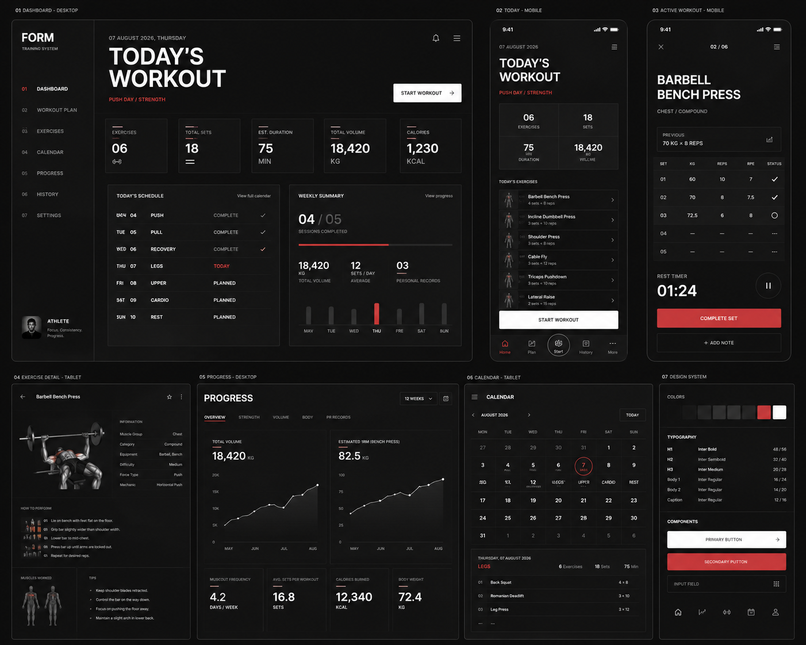

# Personal Workout Tracking Web App — Design System

**Status:** MVP design contract  
**Applies to:** P-01–P-15 across desktop, tablet and mobile
**Related documents:** [Product Requirements](product-requirements.md) · [User Flows](user-flows.md) · [Information Architecture](information-architecture.md) · [Development Roadmap](development-roadmap.md)  
**Visual reference:** [Swiss fitness dashboard](references/swiss-fitness-dashboard.png)

> เอกสารนี้กำหนด visual and interaction contract เท่านั้น ยังไม่กำหนด React component API หรือ implementation library

## 1. Direction

### Design thesis

พื้นที่ทำงานด้านการฝึกสำหรับผู้ใช้คนเดียว จัดลำดับด้วย rational grid ที่มองเห็นอย่างสงบ ใช้ typography ที่แม่นยำและหลักฐานการฝึกจริง—sets, timer, history และ progression traces—เป็นตัวนำสายตาแทนภาพตกแต่ง

ทิศทางนี้ถือเป็น **user-confirmed** จากข้อกำหนด Swiss International Style, dark mode, ความเรียบหรูจริงจัง และ accent red ที่จำกัด

### Reference interpretation

ภาพอ้างอิงเป็น visual reference ไม่ใช่ source of truth ด้าน product scope

| Treatment | สิ่งที่ใช้จากภาพ | การปรับให้เข้ากับผลิตภัณฑ์นี้ |
| --- | --- | --- |
| Preserve | high contrast, strong headings, hairline dividers, tabular numbers, modular data, focused mobile workout | ใช้เป็น grammar หลักของระบบ |
| Evolve | card-heavy framing, tiny uppercase labels, small mobile rows, red repeated across surfaces | ลดกรอบซ้ำ เพิ่มขนาดอ่าน/สัมผัส และจำกัด red budget |
| Replace | Calendar, calories, body metrics, cardio และ decorative anatomy imagery | ใช้ Today, flexible Routine choices, Weekly Frequency/Coverage, strength sets, sync state และ exercise progress ตาม MVP |
| Reject | gradient, glassmorphism, neon glow และ decorative depth | ไม่อนุญาตในระบบนี้ |

## 2. Design principles

1. **Task before decoration** — แต่ละ viewport มี dominant task หนึ่งอย่าง เช่น Start, Resume, Complete Set หรือ Inspect Progress
2. **Grid as logic, not wallpaper** — ใช้ grid กำหนด alignment, spans และ rhythm; แสดงเส้นเฉพาะเมื่ออธิบาย containment, adjacency หรือ sequence
3. **Type carries hierarchy** — ใช้ scale, weight, line height, case และ spacing ก่อนเพิ่มพื้นผิว สี หรือ icon
4. **Training evidence is the visual lead** — ตัวเลข sets/weight/reps/RIR, timer, progression line และ session history ต้องมีน้ำหนักมากกว่าภาพประกอบ
5. **One red decision at a time** — สีแดงใช้กับ current state หรือ action สำคัญสูงสุดเพียงจุดเดียวในบริบทหลัก ไม่ใช้กระจายเพื่อความสวย
6. **Structure through rules and space** — ใช้ border และ whitespace แทน shadow และ rounded cards จำนวนมาก
7. **Mobile is a focused instrument** — Active Workout บน phone เป็นเครื่องมือบันทึกเต็มจอ ไม่ใช่ dashboard desktop ที่ย่อขนาด
8. **State is explicit** — loading, offline, pending, conflict, error และ success ต้องมีข้อความ/icon/รูปทรงประกอบ ไม่พึ่งสีอย่างเดียว
9. **Density follows the task** — desktop planning อนุญาตข้อมูลหนาแน่น; mobile logging ลด metadata และรักษา touch target
10. **Accessibility is structural** — contrast, focus, labels, target size และ reading order เป็นส่วนหนึ่งของ component anatomy ตั้งแต่ต้น

## 3. Color system

### 3.1 Color constraints

- Dark mode เป็น theme หลักของ MVP
- ห้ามใช้ gradient ทุกชนิด รวมถึง skeleton shimmer และ chart area gradient
- ห้ามใช้ glassmorphism, backdrop blur หรือ translucent frosted panels
- ห้ามใช้ neon glow หรือ colored drop shadow
- Default surfaces ไม่มี shadow; overlay ใช้ shadow สีดำอย่างจำกัดได้เมื่อ border อย่างเดียวแยกชั้นไม่พอ
- พื้นที่สีแดงรวมโดยประมาณไม่เกิน 10% ของ viewport และไม่ควรมี red-filled CTA มากกว่าหนึ่งรายการพร้อมกัน
- เมื่อมี error/destructive state ซึ่งใช้สีแดง ให้ลด decorative/current-state red ในพื้นที่เดียวกัน

### 3.2 Foundation tokens

| Token | Value | Role |
| --- | --- | --- |
| `color-neutral-1000` | `#090A0B` | deepest background / overlay scrim base |
| `color-neutral-950` | `#0E0F11` | application canvas |
| `color-neutral-900` | `#141518` | primary surface |
| `color-neutral-850` | `#1A1C20` | raised/interactive surface |
| `color-neutral-800` | `#22242A` | subtle boundary and hover surface |
| `color-neutral-700` | `#30333A` | default border |
| `color-neutral-600` | `#4A4E57` | strong border and disabled foreground |
| `color-neutral-500` | `#737883` | low-priority metadata |
| `color-neutral-400` | `#9EA3AC` | muted readable text |
| `color-neutral-300` | `#C5C8CE` | secondary text |
| `color-neutral-100` | `#F2F3F1` | primary text / inverse action surface |
| `color-white` | `#FFFFFF` | maximum contrast and accent foreground |
| `color-red-700` | `#A9252D` | accent active/destructive pressed |
| `color-red-600` | `#C43139` | red-filled action background |
| `color-red-500` | `#DC4249` | accent line, selected point, progress marker |
| `color-red-400` | `#EE6A70` | error text/icon on dark surface |
| `color-green-400` | `#67B68A` | success text/icon |
| `color-amber-400` | `#D7A94F` | warning/pending text/icon |

### 3.3 Semantic tokens

| Token | Maps to | Usage |
| --- | --- | --- |
| `color-canvas` | `neutral-950` | page background |
| `color-surface` | `neutral-900` | panels, fields, table header |
| `color-surface-interactive` | `neutral-850` | hover/selected neutral surface |
| `color-surface-subtle` | `neutral-1000` | recessed regions and chart plot |
| `color-text-primary` | `neutral-100` | headings, values, body text |
| `color-text-secondary` | `neutral-300` | descriptions and supporting content |
| `color-text-muted` | `neutral-400` | metadata; ไม่ใช้ต่ำกว่า 14 px เมื่อข้อมูลสำคัญ |
| `color-text-disabled` | `neutral-500` | disabled content พร้อม non-color cue |
| `color-border-subtle` | `neutral-800` | internal dividers |
| `color-border-default` | `neutral-700` | component boundary |
| `color-border-strong` | `neutral-600` | active neutral boundary |
| `color-action-primary-bg` | `neutral-100` | default high-priority CTA เช่น Start/Save |
| `color-action-primary-fg` | `neutral-1000` | text/icon on primary action |
| `color-action-accent-bg` | `red-600` | Complete Set/Resume เมื่อเป็น dominant action |
| `color-action-accent-fg` | `white` | text/icon on accent action |
| `color-accent` | `red-500` | active rule, selected chart point, current position |
| `color-focus-ring` | `neutral-100` | keyboard focus ring |
| `color-success` | `green-400` | synced/completed confirmation |
| `color-warning` | `amber-400` | pending/offline attention |
| `color-error` | `red-400` | validation/sync error text and icon |
| `color-destructive-bg` | `red-700` | final destructive confirmation only |

### 3.4 Contrast contract

- Primary text on canvas: `#F2F3F1` / `#0E0F11` ≈ `17.23:1`
- Secondary text on canvas: `#C5C8CE` / `#0E0F11` ≈ `11.44:1`
- Muted text on canvas: `#9EA3AC` / `#0E0F11` ≈ `7.57:1`
- Accent button: `#FFFFFF` / `#C43139` ≈ `5.46:1`
- Error text on surface: `#EE6A70` / `#141518` ≈ `6.03:1`

ค่าข้างต้นเป็น token-level calculations; implementation ต้องตรวจ rendered contrast อีกครั้ง โดยเฉพาะ thin text, opacity, disabled state และ forced-colors mode

## 4. Typography

### 4.1 Font families

- **Primary:** `IBM Plex Sans Thai`, `IBM Plex Sans`, system sans-serif
- **Numeric fallback:** ใช้ primary family พร้อม tabular numerals; ไม่เพิ่ม monospace เพียงเพื่อสร้าง technical look
- Font ต้องครอบคลุมไทย/อังกฤษและไม่ทำให้ layout shift ระหว่างโหลด; หาก web font โหลดไม่ได้ system fallback ต้องยังอ่านได้และ controls ไม่ล้น

### 4.2 Type scale

| Token | Size / line-height | Weight | Tracking | Usage |
| --- | --- | --- | --- | --- |
| `type-display-xl` | `56 / 60 px` | 700 | `-0.035em` | desktop Today hero; ไม่ใช้เกินหนึ่งจุดต่อหน้า |
| `type-display-lg` | `44 / 48 px` | 700 | `-0.03em` | major page statement |
| `type-heading-1` | `36 / 42 px` | 700 | `-0.025em` | page title |
| `type-heading-2` | `28 / 36 px` | 600 | `-0.015em` | section title |
| `type-heading-3` | `22 / 30 px` | 600 | `-0.01em` | panel/exercise title |
| `type-heading-4` | `18 / 26 px` | 600 | `0` | subsection/title row |
| `type-body-lg` | `18 / 28 px` | 400 | `0` | lead/supporting copy |
| `type-body-md` | `16 / 26 px` | 400 | `0` | default body and form text |
| `type-body-sm` | `14 / 22 px` | 400 | `0` | secondary descriptions |
| `type-label-md` | `13 / 20 px` | 600 | `0.02em` | field labels, table headings |
| `type-label-sm` | `12 / 18 px` | 600 | `0.025em` | metadata; ไม่ใช้กับข้อมูลที่ต้องอ่านเร็วระหว่างฝึก |
| `type-data-xl` | `48 / 52 px` | 600 | `-0.025em` | timer / single dominant metric |
| `type-data-lg` | `32 / 36 px` | 600 | `-0.02em` | dashboard metric |
| `type-data-md` | `20 / 24 px` | 600 | `-0.01em` | weight/reps values |
| `type-caption` | `12 / 18 px` | 400 | `0` | timestamps and nonessential notes |

### 4.3 Typography behavior

- ตัวเลข workout ใช้ `tabular-nums`; เวลาใช้ colon alignment ที่คงที่
- English metadata ใช้ uppercase ได้เฉพาะข้อความสั้น; ภาษาไทยไม่บังคับ letter spacing แบบ uppercase
- Body text มี measure เป้าหมาย 45–75 ตัวอักษรต่อบรรทัด
- Heading ตัดบรรทัดตาม phrase; ห้ามลด font จนต่ำกว่า scale เพื่อบังคับหนึ่งบรรทัด
- Mobile mapping: `display-xl → 36/40`, `display-lg → 34/40`, `heading-1 → 30/36`, ส่วน body/labels คงขนาดเดิม
- Active Workout บน phone ใช้ Exercise name อย่างน้อย `22/30` และ editable numeric value อย่างน้อย `20/24`

## 5. Spacing scale

ใช้ base unit `4 px`; component และ layout spacing ต้องเลือกจาก scale นี้ก่อนเพิ่มค่าพิเศษ

| Token | Value | Typical usage |
| --- | --- | --- |
| `space-0` | `0` | joined cells |
| `space-1` | `4 px` | icon/text optical gap, micro separation |
| `space-2` | `8 px` | label/helper gap, compact controls |
| `space-3` | `12 px` | set cells, compact row padding |
| `space-4` | `16 px` | default component gap/mobile gutter |
| `space-5` | `20 px` | medium content grouping |
| `space-6` | `24 px` | panel padding/tablet outer margin |
| `space-8` | `32 px` | section gap/desktop outer margin |
| `space-10` | `40 px` | major section separation |
| `space-12` | `48 px` | page section rhythm |
| `space-16` | `64 px` | desktop page rhythm |
| `space-20` | `80 px` | large editorial separation |
| `space-24` | `96 px` | rare display-level separation |

Rules:

- Gap ภายใน component ใช้ `4–16 px`; ระหว่าง content groups ใช้ `16–32 px`; ระหว่าง page sections ใช้ `32–64 px`
- Phone ใช้ outer margin `16 px`; ห้ามลดต่ำกว่า `12 px` แม้ viewport แคบ
- Sticky mobile action เผื่อ `16 px + safe-area inset` ด้านล่าง
- Optical correction ±`2 px` ทำได้กับ icon/baseline แต่ห้ามสร้าง spacing token ใหม่

## 6. Responsive grids

Grid มีสถานะ **quiet-visible**: alignment และ divider เผย logic ของ grid แต่ไม่วาดเส้นทุก column เป็นพื้นหลัง

### 6.1 Grid specifications

| Range | Columns | Outer margin | Gutter | Container behavior |
| --- | ---: | ---: | ---: | --- |
| Mobile `< 600 px` | 4 | `16 px` | `12 px` | fluid, minimum supported width `320 px` |
| Tablet `600–1023 px` | 8 | `24 px` | `16 px` | fluid; switch one/two-pane by content pressure |
| Desktop `≥ 1024 px` | 12 | `32 px`; `48 px` from `1280 px` | `16 px`; `24 px` from `1440 px` | fluid to max content width `1440 px` |

Desktop app shell ใช้ navigation rail `216 px` ที่ `≥ 1200 px`; ช่วง `1024–1199 px` ใช้ compact rail `72 px` แล้วคำนวณ 12-column content grid จากพื้นที่ที่เหลือ

### 6.2 Recommended spans

| Surface | 4-column mobile | 8-column tablet | 12-column desktop |
| --- | --- | --- | --- |
| Today hero | `4` | `8` | title `8` + action/context `4` |
| Metric group | `2 + 2` | `2 × 4` | `3 × 4` หรือ `2 × 6` ตามจำนวน |
| Plans editor | sequential `4` | selector `3` + editor `5` | library `4` + editor `8` |
| Active Workout | current Exercise `4` | work area `6` + index/timer `2` | index `3` + work area `6` + timer/context `3` |
| History | session rows `4` | list `3` + detail `5` | list `4` + detail `8` |
| Progress | one chart `4` | `4 + 4` | `6 + 6` หรือ hero chart `8` + metrics `4` |
| Forms | `4` | label/content `2 + 6` เมื่อเหมาะ | content `6–8`, ไม่ยืดเต็ม `12` โดยไม่มีเหตุผล |

### 6.3 Grid rules

- Page titles, primary actions, table edges และ chart plots ใช้ shared alignment anchors
- Break regularity ได้เฉพาะเพื่อ dominant task เช่น full-width Active Workout action บน phone
- ห้ามรักษา empty desktop columns บน mobile; เปลี่ยนเป็น priority order
- Component ที่อยู่ใน side pane ต้องตอบสนองต่อ container width ไม่สมมติจาก viewport อย่างเดียว

## 7. Borders, radius, surfaces and depth

### 7.1 Border tokens

| Token | Style | Usage |
| --- | --- | --- |
| `border-subtle` | `1 px solid #22242A` | internal row/chart grid divider |
| `border-default` | `1 px solid #30333A` | input, panel and table boundary |
| `border-strong` | `1 px solid #4A4E57` | active neutral control / high-priority separation |
| `border-accent` | `2 px solid #DC4249` | selected/current edge or underline; ไม่ล้อมทุกด้านโดย default |
| `border-error` | `1 px solid #EE6A70` | invalid field plus text/icon |
| `border-focus` | `2 px solid #F2F3F1`, offset `2 px` | keyboard focus; ต้องไม่ถูก sticky region บัง |

Border rules:

- ใช้ horizontal dividers ก่อน full card outlines
- ไม่ซ้อน panel border และ child card border ถ้า spacing/alignment อธิบาย grouping ได้แล้ว
- Selected row ใช้ accent edge + weight/icon ไม่ใช้ red fill เต็มแถว
- Forced-colors mode ต้องคง boundary และ focus ด้วย system colors

### 7.2 Radius tokens

| Token | Value | Usage |
| --- | ---: | --- |
| `radius-0` | `0` | tables, joined set cells, chart plots |
| `radius-1` | `2 px` | buttons, fields, compact controls |
| `radius-2` | `4 px` | panels, tooltips, menus |
| `radius-3` | `8 px` | app shell edge, modal, mobile sheet top corners only |
| `radius-full` | `999 px` | status dot/badge or circular timer control only |

ห้ามใช้ pill shape กับ buttons, inputs, tabs หรือ cards ทั่วไป

### 7.3 Shadows

- `shadow-none`: default สำหรับ page, panel, card, button และ input
- `shadow-overlay`: `0 16px 40px rgba(0,0,0,0.38)` ใช้ได้เฉพาะ modal, menu หรือ sheet ที่ลอยข้ามหลาย surfaces
- Sticky header/footer ใช้ border แยกชั้นก่อน shadow
- ห้ามใช้ colored shadow, inner glow หรือ stacked shadows

## 8. Buttons

### 8.1 Shared anatomy

- Label ชัดเจน + optional leading/trailing icon
- Icon-only button ต้องมี accessible name และ tooltip เมื่อเหมาะ
- Default height `44 px`; mobile/Active Workout `48 px`; compact desktop-only `36 px`
- Horizontal padding `16 px` default, `20 px` mobile primary
- Minimum touch target `44 × 44 px` แม้ visual icon เล็กกว่า
- Long label wrap ได้สูงสุดสองบรรทัดใน mobile full-width action; desktop button ให้ขยายความกว้างก่อน truncate

### 8.2 Variants

| Variant | Visual treatment | Product use |
| --- | --- | --- |
| Primary | light surface, dark text, `radius-1` | Start Workout, Save Template, Done |
| Accent | red-600 surface, white text | Resume หรือ Complete Set ที่เป็น dominant action; หนึ่งรายการต่อ viewport |
| Secondary | transparent/surface, default border, primary text | View Plan, Add Exercise, timer controls |
| Quiet | transparent, no border, primary/secondary text | Back, Cancel, inline actions |
| Destructive | error text + error border; red-700 fill เฉพาะ final confirm | Discard, soft-delete, remote abandon |
| Icon | square target, neutral treatment | menu, close, overflow, reorder controls |

### 8.3 Interaction states

- Hover: เปลี่ยน surface/border หนึ่งระดับ; ไม่ใช้ glow หรือ translate
- Focus-visible: `border-focus` รอบ target ทั้งชิ้น
- Active/pressed: ลดความสว่างหนึ่งระดับ; ห้ามใช้ scale ที่ทำให้ layout ขยับ
- Disabled: ลด contrast พร้อม disabled cursor/attribute; label ต้องยังอ่านเหตุผลได้จาก helper text
- Loading: รักษาความกว้างเดิม, แสดง progress indicator + label เช่น “Saving”; ไม่ใช้ gradient shimmer
- Destructive: ต้องมี confirmation ตามความเสี่ยงและ focus เริ่มที่ safe action

## 9. Form inputs

### 9.1 Anatomy

1. Visible label
2. Optional/required indicator เมื่อจำเป็น
3. Input control
4. Helper, unit หรือ constraint
5. Error/success message ที่เชื่อมกับ control

### 9.2 Base treatment

- Height `44 px` desktop/tablet และ `48 px` phone/Active Workout
- Background `color-surface`; border `border-default`; radius `radius-1`
- Text `type-body-md`; numeric workout inputs ใช้ `type-data-md` และ tabular numerals
- Horizontal padding `12–14 px`; unit suffix อยู่ใน fixed trailing zone และไม่แทน label
- Placeholder เป็นตัวอย่างเท่านั้น ไม่ใช้แทน visible label
- Focus ใช้ white focus ring; error ใช้ red border + icon + text; success ไม่จำเป็นต้องเปลี่ยน border ถ้ามี confirmation ใกล้เคียง

### 9.3 Field types

- **Text/search:** search มี clear action ขนาด 44 px และประกาศจำนวนผลลัพธ์เมื่อเปลี่ยน
- **Numeric set field:** เปิด numeric keyboard บน mobile; แยก `kg`, `reps`, `RIR` ด้วย visible column labels; ไม่ auto-submit เมื่อ value เปลี่ยน
- **Select/filter:** desktop ใช้ menu; mobile ใช้ sheet/full-screen picker เมื่อรายการยาว
- **Checkbox/radio:** visual control อย่างน้อย 20 px ภายใน target 44 px; label กดได้ทั้งแถว
- **Set type:** ใช้ labeled segmented control หรือ select; warm-up/working แยกด้วยข้อความและ icon ไม่พึ่งสี
- **Read-only:** คง contrast ที่อ่านได้และแสดง lock/reason; ไม่ทำให้ดูเหมือน disabled data ที่หายไป

### 9.4 Validation behavior

- Validate เมื่อ blur/submit หรือทันทีหลังผู้ใช้พยายาม Complete Set; ไม่แสดง error ก่อนมี interaction
- เก็บค่าที่ถูกต้องไว้เมื่อ server/network error
- Focus ไป error summary เฉพาะ form ยาว; inline error อยู่ติด field
- Weight `≥ 0`, completed reps เป็นจำนวนเต็มบวก และ RIR เป็นจำนวนเต็ม `0–10` ตาม Product Requirements

## 10. Navigation patterns

### Desktop

- Persistent left rail `216 px`; compact `72 px` ที่ desktop แคบ
- Logo/product name ด้านบน; Today, Plans, Exercises, History, Progress เป็น primary items
- Settings และ sync status อยู่ท้าย rail
- Notification Center ใช้ utility trigger ใน shell พร้อม unread count; ไม่เพิ่มเป็น primary rail item
- Active item ใช้ white label + red `2 px` leading rule และ position cue; ไม่ใช้ red-filled row
- Rail ไม่ scroll พร้อม main content เมื่อ viewport สูงพอ

### Tablet

- Landscape ใช้ compact/collapsible rail; portrait ใช้ top bar + drawer
- Drawer ปิดด้วย Escape, outside click และคืน focus ให้ trigger
- Current page title อยู่ใน top bar เพื่อรักษา orientation เมื่อ rail ถูกซ่อน
- Notification trigger อยู่ใน top bar และเปิด drawer/full pane โดยคืน focus ให้ trigger เมื่อปิด

### Mobile

- Bottom navigation: Today, Plans, History, Progress และ More
- Target แต่ละรายการอย่างน้อย `48 px` สูง; icon + text label เสมอ
- Exercises และ Settings อยู่ใน More หรือ contextual entry ตาม IA
- Notification Center ใช้ top-bar trigger แยกจาก bottom navigation และมี accessible unread label
- Active Workout ซ่อน global navigation และใช้ close/back, position `02 / 06`, overflow และ sticky action ภายใน workflow
- Bottom navigation/sticky action ต้องไม่ทับเนื้อหาเมื่อ zoom, soft keyboard หรือ safe-area inset เปลี่ยน

### Navigation state rules

- Offline/pending ใช้ compact status ใกล้ shell แต่ไม่เปลี่ยนตำแหน่ง navigation
- Deep detail มี breadcrumb บน desktop; mobile ใช้ back title pattern
- ห้ามใช้ hover-only submenu
- Reorder interactions ต้องมี move up/down keyboard and touch alternatives

### Notification Center

- Desktop ใช้ utility panel หรือ feed page; tablet/mobile ใช้ full pane โดยคง page title และ back behavior
- Notification แต่ละรายการเป็น feed row มีช่วง Routine Week, Frequency/Coverage และ Routine Days ที่ขาด ไม่ใช้ card shadow แยกทุกแถว
- Unread ใช้ weight/leading marker พร้อมข้อความที่ screen reader เข้าใจ ไม่พึ่ง accent dot อย่างเดียว
- การเปิดรายการ mark read และนำไป Weekly Routine History; Dismiss เป็น secondary action แยกและไม่เท่ากับลบประวัติ
- มี action `ดูประวัติ Routine ทั้งหมด` ที่มองเห็นได้โดยไม่ต้อง dismiss notifications ก่อน
- หลายสัปดาห์ต้องแสดงเป็นหลาย rows ตามลำดับใหม่ไปเก่า พร้อม keyboard focus และ touch target อย่างน้อย `44 × 44 px`

## 11. Table and set-grid patterns

### 11.1 Desktop/tablet data tables

- Header `type-label-sm/medium`, secondary text, height `40 px`
- Body row default `48 px`; compact planning table ต่ำสุด `44 px`
- Horizontal divider `border-subtle`; vertical lines ใช้เฉพาะเมื่อช่วยแยก numeric groups
- Text align left; dates/IDs ตาม locale; numeric values align right ด้วย tabular numerals
- Sort state ใช้ icon + accessible label; selected row ใช้ accent leading rule ไม่ใช้ full red fill
- Hover ใช้ `surface-interactive`; focus อยู่ที่ row action หรือ link ที่ชัดเจน
- Sticky header ใช้ opaque surface + bottom border ไม่มี blur
- Empty table แสดง Empty State แทน row ปลอม

### 11.2 Active Workout set grid

- Phone row แบ่งเป็น: set number, weight, reps, RIR และ status/action
- Column labels ต้องคงเห็นหรือประกาศผ่าน accessible labels
- Editable cells สูงอย่างน้อย `48 px`; status action มี target `44 × 44 px`
- Completed row ใช้ check icon + text/accessible status; current row ใช้ strong border/weight; pending ใช้ warning icon/label
- Warm-up row ใช้ `W`/“Warm-up” label และ neutral styling ไม่ใช้สีอย่างเดียว
- ห้ามบีบ grid ต่ำกว่า usable width; ถ้าพื้นที่ไม่พอให้เปลี่ยนเป็น two-line set row ไม่ใช้ horizontal page scroll

### 11.3 Mobile history/list transformation

- Desktop History table เปลี่ยนเป็น stacked session rows/cards บน phone
- รักษาลำดับ: date/template → primary metric → exercise summary → status/action
- ใช้ divider และ whitespace; ไม่สร้าง rounded card แยกทุก record หาก list เดียวกันอธิบาย adjacency ได้

## 12. Chart appearance

### Visual grammar

- Plot background ใช้ `color-surface-subtle`; panel อาจมี default border แต่ไม่มี shadow
- Gridlines `border-subtle` 1 px; ลดจำนวน gridlines ให้พออ่านค่า
- Primary series เป็นเส้น `2 px` สี `neutral-100`
- Comparison series ใช้ neutral-400/600 และ dash pattern ต่างกัน ไม่ใช้ rainbow palette
- Accent red ใช้เฉพาะ selected series, current point หรือ PR marker
- Data points default `4 px`; selected target อย่างน้อย `8 px` visual และ hit area อย่างน้อย `24 px`
- ไม่มี gradient area fill; หากต้องแสดง area ใช้ solid neutral/accent opacity ต่ำและต้องไม่ลด text contrast
- Axis/caption ใช้ `type-caption` หรือ `label-sm`; values ใช้ tabular numerals และหน่วยชัดเจน
- Tooltip ใช้ opaque surface, default border, radius-2 และไม่มี glow

### Product rules

- Exercise Progress แสดง volume และ estimated 1RM แยก chart หรือแยก axis ชัดเจน; หลีกเลี่ยง dual-axis ที่ทำให้ตีความผิด
- PR ใช้ red marker + `PR` label; ทุก point ที่ interactive เชื่อมไป source Session ได้
- Loading chart รักษาความสูงด้วย static plot skeleton; Empty chart แสดงคำแนะนำแทนแกนเปล่า
- ทุก chart มี text summary และ accessible data table/list; keyboard เลื่อนไป data points หรือ alternative list ได้
- ไม่ใช้ animation เป็นหลักฐานของ trend; reduced motion ปิด draw-in transitions

## 13. Application states

### Loading

- รักษา geometry ของ content เพื่อลด layout shift
- ใช้ static blocks สี neutral-800 หรือ opacity pulse เบา ๆ; ห้าม gradient shimmer
- Button loading รักษาความกว้างเดิมและมีข้อความสถานะ
- หาก Active Session อยู่ใน IndexedDB ให้แสดง local data ก่อน network refresh

### Empty

- ใช้ heading สั้น, เหตุผล, next action และ optional factual hint
- จัดตาม grid พร้อม top rule/number marker; ไม่ใช้ illustration ขนาดใหญ่เพื่อเติมพื้นที่
- ตัวอย่าง: No Active Routine → Create/Activate Routine; No Progress → Complete a working set

### Error

- ใช้ error icon/label + red rule หรือ border เฉพาะจุด ไม่ใช้ red surface เต็มหน้า
- อธิบายสิ่งที่เกิดขึ้น สิ่งที่ยังปลอดภัย และ recovery action
- Form error ต้องรักษาค่าที่กรอก; sync error ต้องรักษา pending operations
- Full-page error มี Retry และ safe navigation; destructive action ไม่เป็น default focus

### Success

- ใช้ green icon/label หรือ concise inline acknowledgement; ไม่ใช้ confetti
- Success toast หายได้แต่ผลลัพธ์สำคัญต้องคงใน content เช่น completed set row หรือ Completion Summary
- Completion Summary เป็น destination state ไม่ใช่ modal overlay ชั่วคราว

### Offline and pending

- ใช้ amber/neutral icon + label `Offline` หรือ `Pending sync`; ไม่ใช้สีอย่างเดียว
- Indicator compact และ persistent โดยไม่แย่ง Complete Set
- Logging controls ยัง active เมื่อ local data พร้อม; online-only mutations อธิบายเหตุผลที่ disabled

### Conflict and read-only

- ใช้ strong boundary, conflict title, owner-device information และ local/server summary
- Mutation controls disabled/removed อย่างชัดเจน
- Primary recovery คือกลับ owner device; remote abandon เป็น secondary destructive action
- ห้าม merge หรือเลือก version ให้อัตโนมัติ

### Disabled and destructive

- Disabled control ต้องมีเหตุผลใน helper/tooltip เมื่อไม่ชัดจากบริบท
- Destructive confirmation ระบุ object และผลกระทบต่อ History/Progress
- การแก้หรือลบ Session ที่กระทบ Frequency/Coverage ต้องระบุ Routine Week และผลที่จะคำนวณใหม่ โดยไม่สร้าง Notification Center item ใหม่จาก action นี้
- Safe action อยู่ก่อน destructive action ทั้งใน focus order และ visual hierarchy

## 14. Desktop, tablet and mobile behavior

### Cross-device rules

- Content priority, terminology และ state meaning ต้องเหมือนกันทุกอุปกรณ์
- เปลี่ยน composition, density, navigation และ control placement ได้ แต่ห้ามซ่อน critical state
- Touch-first view ห้ามพึ่ง hover; desktop ต้องใช้ keyboard ได้ครบ
- Sticky regions ต้องไม่บัง focus, errors, last row หรือ chart controls
- ทดสอบอย่างน้อยประมาณ `360`, `768`, `1280` และ `1600 px` รวมถึง `200%` zoom

### Surface behavior matrix

| Surface | Desktop | Tablet | Mobile |
| --- | --- | --- | --- |
| Today | 12-column hero, metrics และ context side-by-side | 8-column stacked/two-pane | next action first, metrics `2 × 2`, short preview |
| Exercise Library | filter rail + dense list/detail | collapsible filters + full detail pane | search first, filter sheet, push detail |
| Plans | library + template canvas; keyboard reorder | selector drawer + editor | step-based sections and move controls |
| Active Workout | Exercise index + set workspace + timer/context | main workspace + compact index/timer | full-screen single Exercise, sticky Complete Set |
| History | sortable table + detail pane | list then detail | labeled session rows; no squeezed desktop table |
| Notification Center | utility panel/feed rows | drawer/full pane | full-page feed with read/dismiss actions |
| Weekly Routine History | weekly table + detail pane | week list then detail | summary rows with pushed week detail |
| Progress | paired charts and metric rail | one/two charts per row | one metric/chart per section with accessible summary |
| Modal/confirm | centered modal max-width | modal or side sheet | bottom sheet/full-screen confirm; safe-area aware |

### Mobile ergonomics

- Minimum interactive target `44 × 44 px`; primary workout actions สูง `48–52 px`
- Adjacent destructive/confirm targets เว้นอย่างน้อย `8 px`
- Numeric fields ไม่เล็กกว่า `48 px` สูงและไม่ trigger viewport zoom
- Bottom action เผื่อ keyboard และ safe area; content มี padding-bottom เท่าความสูง sticky region + `16 px`
- Long Thai/English labels wrap ก่อน truncate; critical values และ units ห้ามถูกตัด

## 15. Motion and feedback

- Duration: micro feedback `120–180 ms`; panel/sheet transition `180–240 ms`
- ใช้ standard ease-out สำหรับ entering และ ease-in สำหรับ leaving
- อนุญาต motion สำหรับ set completion, timer start/pause, sync acknowledgement และ spatial navigation
- ห้าม ambient looping animation, glowing pulse หรือ motion ที่แย่ง attention จาก logging
- `prefers-reduced-motion` ปิด movement/animated count-up และใช้ instant state + opacity change สั้นหรือไม่มี animation

## 16. Accessibility contract

- เป้าหมาย WCAG 2.2 AA สำหรับ contrast และ core interaction behavior; ต้องตรวจ rendered implementation ก่อนอ้าง compliance
- Semantic landmarks, heading order, buttons, links, labels และ native table semantics เมื่อยังเป็น table
- Visible focus ring ต้องชัดบนทุก surface และไม่ถูก clipped
- State และ chart data ต้องมี non-color cue และ text alternative
- Form errors เชื่อมกับ input; error summary จัด focus สำหรับ form ยาว
- Drag/reorder มี keyboard และ single-pointer alternatives
- Overlay ปิดด้วย Escape, trap focus อย่างเหมาะสม และคืน focus ไป trigger
- รองรับ screen zoom, text expansion, Thai/English mixed content และ locale-aware numbers/dates
- Sound/vibration จาก timer เป็น optional enhancement; มี visual/text state เสมอ
- Forced-colors/high-contrast mode รักษา borders, selected state และ focus ด้วย system colors

## 17. Design QA checklist

ก่อนอนุมัติหน้าจอหรือ component implementation ให้ตรวจว่า:

1. Dominant task เห็นได้ภายในไม่กี่วินาทีและมี red-filled action ไม่เกินหนึ่งรายการ
2. Red coverage โดยประมาณไม่เกิน 10% และไม่มี gradient, glass, glow หรือ decorative shadow
3. Layout ใช้ 4/8/12-column rules และ recompose บน mobile แทนการย่อ
4. Type roles, spacing, borders และ radius มาจาก tokens; ไม่มีค่าที่ใกล้เคียงกันโดยไร้เหตุผล
5. Default, hover, focus, active, selected, disabled, loading, empty, error, success และ destructive states ครบตาม component
6. Phone target อย่างน้อย 44 px; sticky action ไม่บัง content/focus
7. Tables, set grid และ charts ไม่ overflow และมี accessible alternative
8. Offline/pending/conflict states รักษาข้อมูลและไม่ทำให้ผู้ใช้เข้าใจว่า sync สำเร็จแล้ว
9. ตรวจ viewports ประมาณ 360, 768, 1280 และ 1600 px, keyboard-only, reduced motion และ 200% zoom
10. แยกสิ่งที่ตรวจจาก rendered implementation ออกจากสิ่งที่ยังเป็น design assumption
