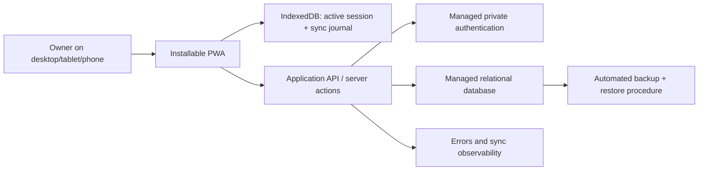

# Personal Workout Tracking Web App — Development Roadmap

**Product scope:** [Product Requirements](product-requirements.md)  
**System behavior:** [User Flows](user-flows.md)  
**Screens and navigation:** [Information Architecture](information-architecture.md)

## 1. Delivery objective

ส่งมอบ MVP แบบ installable PWA ภายใน 6–8 สัปดาห์สำหรับ solo developer โดยให้ความสำคัญกับ data integrity, mobile logging และ offline recovery มากกว่าปริมาณฟีเจอร์

Roadmap นี้ยังไม่เลือก vendor หรือสร้าง application code; เกณฑ์เลือก managed services คือรองรับ private auth, relational transactions, automated backups และ deployment ที่ดูแลน้อย

## 2. Architecture recommendation

ใช้ **modular monolith** ที่มี client/PWA และ managed backend หนึ่งชุด ไม่ใช้ microservices, external queues หรือ real-time collaboration ใน MVP

### Layer responsibilities

| Layer | Responsibility |
| --- | --- |
| Client/PWA | responsive UI, local validation, timer, IndexedDB transactions, optimistic local state, sync coordination |
| Application layer | authorization, business rules, idempotency, version checks, atomic Routine advancement, progress queries |
| Data layer | server source of truth สำหรับ synced entities, relational integrity, soft delete, backups |
| Integration layer | managed auth, hosting, logging/monitoring; ไม่มี fitness integrations ใน MVP |

## 3. Module boundaries และ data ownership

| Module | Owns | Depends on |
| --- | --- | --- |
| Identity & Preferences | owner identity, unit/timer/timezone preferences | managed auth |
| Exercise Catalog | starter/custom Exercises, taxonomy, archive state | Identity |
| Planning | Templates, TemplateExercises, Routines, next index | Exercise Catalog |
| Workout Execution | Session snapshot, SessionExercises, SetLogs, timer state | Planning, Exercise Catalog, Sync |
| History | completed/edited/soft-deleted Sessions | Workout Execution |
| Progress | derived volume, estimated 1RM, PR, trends | History |
| Sync | device ownership, local journal, idempotency, versions, conflict state | Workout Execution, backend API |
| App Shell | navigation, responsive layouts, shared states, offline indicator | ทุก feature module |

Boundary rules:

- Planning ห้ามแก้ Session snapshots
- Progress อ่าน Completed Sessions แต่ไม่แก้ source data
- History mutation ต้อง invalidate Progress ผ่าน application boundary เดียวกัน
- Sync ไม่ตีความ fitness business rules เอง; ส่ง ordered operations และรับ authoritative result
- UI ห้ามเขียน server database โดยตรงโดยข้าม authorization/business rules

## 4. Offline และ sync design

### Local scope

IndexedDB เก็บ:

- Active Session และ Session snapshot
- SessionExercises และ SetLogs ของ Active Session
- Pending SyncOperations พร้อม stable operation ID
- Minimal cached reference data ที่ต้องใช้แสดง Active Workout
- Last acknowledged server version และ last sync timestamp

Plan editing, Exercise mutations, History edits และ Progress queries ต้อง online ใน MVP

### Mutation protocol

1. Client validate input
2. Client สร้าง entity/operation IDs
3. Local entity change และ journal append สำเร็จใน IndexedDB transaction เดียวกัน
4. UI render จาก local state
5. Coordinator ส่ง operation, device ID และ expected server version
6. Server ตรวจ auth, owner device, state transition และ idempotency key
7. Server commit entity change และ Routine advancement แบบ transaction เมื่อ Finish
8. Client ลบ journal entry หลัง acknowledgement เท่านั้น

### Conflict policy

- ไม่มี last-write-wins และไม่มี automatic multi-device merge
- Non-owner device เป็น read-only
- Version mismatch หยุดเฉพาะ queue ของ Session ที่เกี่ยวข้อง
- เก็บ local conflicting copy จนผู้ใช้ตัดสินใจ
- Explicit remote abandon ต้องมีคำเตือนและไม่ลบ unsynced local copy จากอุปกรณ์เดิม

## 5. Milestones

### M-01 — Foundation and product skeleton (สัปดาห์ 1)

**Deliverables**

- Project foundation, environments และ installable PWA shell
- Managed owner authentication; public registration disabled
- Relational domain model และ migration workflow
- Responsive navigation frames สำหรับ desktop, tablet และ phone
- Error logging, environment separation และ backup policy

**Covers:** FR-AU-01–03, NFR-01, NFR-05–09  
**Exit criteria:** Owner login เข้า protected shell ได้; unauthorized access ถูกปฏิเสธ; PWA installability และ base responsive layouts ผ่าน smoke test

### M-02 — Exercise Library and Planning (สัปดาห์ 2)

**Deliverables**

- Starter/custom Exercise Library, controlled metadata, search/filter และ archive
- Workout Template Editor พร้อม targets และ reorder alternatives
- Routine sequence, weekly frequency และ single Active Routine
- Today empty/setup state

**Covers:** FR-EX-01–04, FR-PL-01–05, FR-TD-03  
**Exit criteria:** สร้าง Routine A → B → C และ activate ได้; archive ไม่ทำลาย references; Template validation และ accessibility checks ผ่าน

### M-03 — Today and online Workout Execution (สัปดาห์ 3)

**Deliverables**

- Today resolution, planned/ad-hoc start และ Resume priority
- Template snapshot และ single Active Session
- Set logging, previous values, session flexibility และ rest timer
- Exit, Finish, Discard และ Completion Summary
- Atomic Routine advancement สำหรับ planned completion

**Covers:** FR-TD-01–04, FR-AW-01–07, FR-AW-10–11, FR-ST-03  
**Exit criteria:** Online end-to-end workout flow ผ่าน; planned/ad-hoc/discarded advancement behavior ถูกต้อง; Template edit ไม่กระทบ Session snapshot

### M-04 — Offline reliability and device ownership (สัปดาห์ 4)

**Deliverables**

- IndexedDB Active Session store และ SyncOperation journal
- Reload/browser-restart recovery
- Idempotent retry, version check และ sync status UI
- Owner-device read-only behavior, conflict state และ explicit abandon policy

**Covers:** FR-AW-02–03, FR-AW-08–09, FR-ST-02, NFR-03–04  
**Exit criteria:** Offline/reconnect tests ไม่สูญหายหรือสร้าง SetLog ซ้ำ; non-owner mutation ถูกปฏิเสธทั้ง client/server; conflict ไม่ overwrite ข้อมูล

### M-05 — History and Basic Progress (สัปดาห์ 5–6)

**Deliverables**

- History list, detail, retrospective edit และ soft delete
- Progress invalidation หลัง History mutation
- Exercise trends, volume, estimated 1RM, PR และ source-session links
- Unit preference และ empty/recalculating/error states

**Covers:** FR-HI-01–05, FR-PR-01–05, FR-ST-01  
**Exit criteria:** metrics trace กลับ Session ได้; edit/delete คำนวณใหม่ถูกต้อง; warm-up/deleted data ไม่เข้า Progress

### M-06 — Responsive and accessibility QA (สัปดาห์ 7)

**Deliverables**

- Desktop/tablet/phone recomposition ตาม IA
- Full-screen mobile Active Workout และ sticky safe-area actions
- Keyboard reorder, focus management, chart alternatives และ reduced motion
- Shared loading/empty/offline/error/conflict/success states

**Covers:** NFR-01–02, NFR-09 และทุก P-01–P-13  
**Exit criteria:** Core flows ผ่าน device matrix, keyboard-only test, touch-target audit และ contrast audit

### M-07 — Release hardening (สัปดาห์ 8)

**Deliverables**

- Full end-to-end regression และ sync failure drills
- Production owner account และ reviewed starter data
- Monitoring dashboard/alerts ที่จำเป็น
- Backup/restore rehearsal, release checklist และ recovery notes

**Covers:** NFR-05–08 และ acceptance criteria ทั้งชุด  
**Exit criteria:** ไม่มี critical defect; restore test สำเร็จ; production smoke test และ MVP acceptance walkthrough ผ่าน

## 6. Testing strategy

### Unit tests

- Routine next-index wrap และ planned/ad-hoc advancement
- SetLog validation และ unit conversion
- Working-set volume, Epley estimated 1RM สำหรับ 1–10 reps และ PR calculation
- Progress filtering สำหรับ warm-up, discarded และ soft-deleted Sessions
- Sync operation ordering, retry classification และ idempotency helpers

### Integration tests

- Owner authorization ทุก mutation
- Template snapshot isolation
- Atomic Finish + Routine advancement
- History edit/delete + Progress invalidation
- Exercise archive reference integrity
- Device ownership/version conflict responses

### Offline/sync tests

- Start/log/edit/finish ขณะ offline ตามข้อมูลที่ cache พร้อม
- Reload และ browser restart พร้อม pending operations
- Network loss ระหว่าง request และ response
- Duplicate request ด้วย operation ID เดิม
- Out-of-order/retry operations
- สองอุปกรณ์เริ่ม Session ขณะ offline และ conflict หลัง reconnect
- Auth expiration ขณะมี pending operations

### Responsive/accessibility tests

- Phone portrait, tablet portrait/landscape และ desktop
- Active Workout with soft keyboard และ safe-area inset
- Keyboard-only navigation/reorder
- 200% zoom, long Thai/English labels และ reduced motion
- WCAG AA contrast, visible focus, associated form errors และ chart text alternatives

### End-to-end acceptance

- Initial login/setup → Routine → Today → Active Workout → History → Progress
- Missed-day ordered sequence A → B → C
- Ad-hoc Session ไม่เลื่อน Routine
- Offline logging/recovery/reconnect
- Non-owner device lock และ conflict explanation
- Retrospective edit/delete พร้อม metrics refresh

## 7. Release readiness และ operations

ก่อน production release ต้องมี:

- Public registration ปิดและ owner authorization ถูกทดสอบ
- Production secrets แยกจาก development และไม่อยู่ใน source control
- Automated managed-database backup และ documented retention
- Restore rehearsal บน non-production environment
- Error logging สำหรับ authentication, mutation, progress calculation และ sync failures
- Alert เมื่อ server errors หรือ sync failures เกิน threshold ที่กำหนด
- Minimal health check และ deployment rollback procedure
- Starter Exercise data review และ Terms/Privacy note สำหรับข้อมูลส่วนตัว แม้เป็น owner-only app
- Known limitations: Active Workout offline boundary, single-device ownership และ browser-storage risk

## 8. Deferred capabilities

| Future capability | เพิ่มหลัง MVP เพราะ | Architecture preparation ใน MVP |
| --- | --- | --- |
| Cardio/mobility metrics | เปลี่ยน set/metric model และ UI | แยก Exercise/Session modules แต่ไม่สร้าง generic engine ล่วงหน้า |
| Calendar/training blocks | เพิ่ม date rules และ scheduling | Routine sequence ไม่ผูก calendar |
| Advanced set types/supersets | เพิ่ม execution semantics | เก็บ ordered SessionExercises และ set type ที่ขยายได้ |
| Automatic progression/coaching | ต้องใช้ trusted rules/data | Progress เป็น derived และ trace กลับ source ได้ |
| Body metrics/goals | เป็น domain ใหม่ | ไม่รวมใน Workout Session schema |
| Import/export | ต้องกำหนด stable external contract | ใช้ stable entity IDs ภายในก่อน |
| Wearables/health platforms | external permissions/sync complexity | Integration layer แยกจาก domains |
| Cross-device handoff/multi-user | concurrency และ authorization เพิ่มมาก | device ownership/versioning เป็นฐาน แต่ไม่ทำ live merge |

## 9. Cross-document traceability

| Requirement group | User flows | Pages | Milestones | Primary verification |
| --- | --- | --- | --- | --- |
| FR-AU-01–03 | UF-01 | P-01, P-02 | M-01 | private login, session expiry, unauthorized request tests |
| FR-EX-01–04 | UF-02 | P-03, P-04 | M-02 | search/filter, duplicate validation, archive integrity |
| FR-PL-01–05 | UF-03 | P-05, P-06 | M-02 | Template/Routine validation, snapshot isolation |
| FR-TD-01–04 | UF-04, UF-05 | P-02, P-07 | M-02, M-03 | resume priority, sequence resolution, ad-hoc behavior |
| FR-AW-01–07 | UF-05–07 | P-07, P-08 | M-03 | start/log/timer/finish/discard end-to-end |
| FR-AW-08–09 | UF-06, UF-08, UF-09 | P-07, P-13 | M-04 | offline reload, idempotent retry, conflict tests |
| FR-AW-10–11 | UF-07 | P-02, P-07, P-08 | M-03 | lifecycle and Routine advancement tests |
| FR-HI-01–05 | UF-10 | P-09, P-10 | M-05 | edit/delete and invalidation tests |
| FR-PR-01–05 | UF-07, UF-10, UF-11 | P-08, P-10–P-12 | M-05 | calculation, filtering and source trace tests |
| FR-ST-01–03 | UF-06, UF-08, UF-09 | P-07, P-13 | M-03–M-05 | unit/timer/sync-state tests |
| NFR-01–02, NFR-09 | ทุก core flow | P-01–P-13 | M-01, M-06 | device matrix, accessibility and visual audit |
| NFR-03–04 | UF-05–09 | P-02, P-07, P-13 | M-04 | durability, versioning and data-integrity tests |
| NFR-05–08 | UF-01, UF-08–11 | ทุก protected page | M-01, M-07 | security, logging, backup/restore and maintainability review |

## 10. Documentation consistency gate

ก่อนปิด milestone เอกสารหรือเริ่ม application implementation ให้ตรวจว่า:

1. Requirement ID ทุกตัวใน flows และ roadmap มีอยู่ใน Product Requirements
2. Flow ทุกตัวอ้าง Page ID ที่มีอยู่ใน Information Architecture
3. MVP requirement ทุกกลุ่มมี milestone และ primary verification ใน traceability table
4. คำว่า Routine, Template, Active Session, Completed Session และ owner device ใช้ความหมายเดียวกัน
5. Ordered sequence, ad-hoc behavior, snapshot, offline boundary และ device ownership ไม่มีข้อกำหนดขัดกัน
6. Future/Out-of-scope capabilities ไม่ปรากฏเป็น M-01–M-07 deliverables
7. Relative links ระหว่างเอกสารเปิดได้และ heading anchors ที่อ้างมีอยู่จริง
