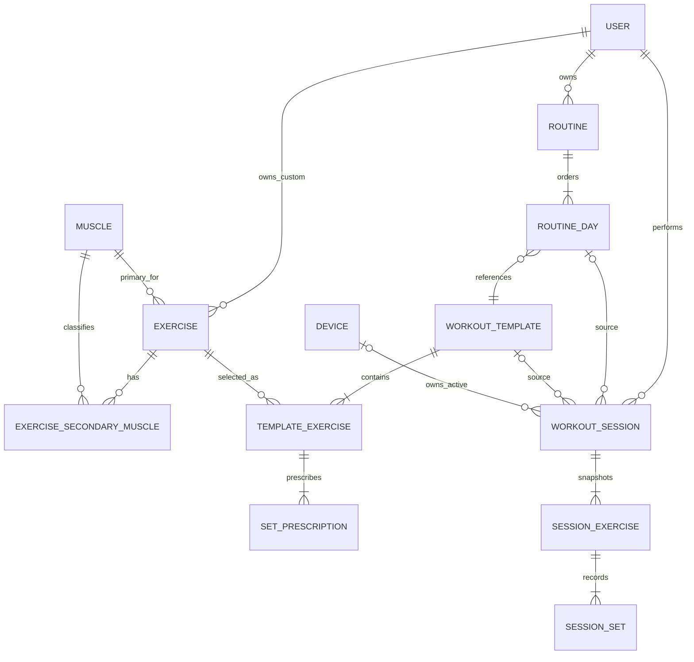
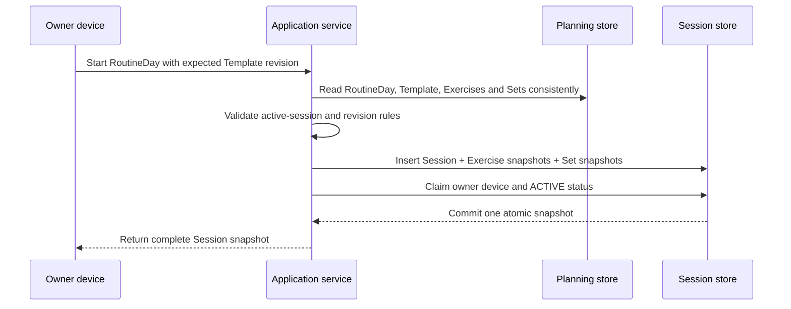

# Personal Workout Tracking App — Domain Model

**Status:** Logical domain design; no database implementation  
**Sources:** [Product Requirements](product-requirements.md) · [User Flows](user-flows.md)  
**Companion documents:** [Database Schema](database-schema.md) · [Data Rules](data-rules.md)

## 1. Purpose and terminology

โมเดลนี้ออกแบบให้ Planning และ Workout History แยก ownership กันอย่างชัดเจน เพื่อให้การแก้แผนในอนาคตไม่เปลี่ยนประวัติที่เกิดขึ้นแล้ว

คำศัพท์เชื่อมกับเอกสารเดิม:

- **Workout Plan** ในภาษาผู้ใช้ตรงกับ aggregate `Routine`
- **Plan Day** คือ `RoutineDay` ที่อ้าง `WorkoutTemplate` หนึ่งรายการ
- **Workout Template** คือแบบฝึกหนึ่งวัน มี Exercises และ planned sets ตามลำดับ
- **Workout Session** คือเหตุการณ์ฝึกจริง; เมื่อเริ่มจาก Plan จะมี session-owned snapshot ของวันนั้น
- **SetLog** ในเอกสารเดิมตรงกับ actual values ภายใน `SessionSet`

## 2. Bounded contexts

### Requirement alignment

| Capability | Existing requirement / extension |
| --- | --- |
| Primary and secondary Muscles | FR-EX-01 |
| Multi-day Routine and ordered Exercises | FR-PL-01–03 |
| Per-set targets, rest and execution edits | FR-PL-02, FR-AW-04–07 |
| Atomic Session snapshot and stable History | FR-AW-01, FR-PL-05, BR-04 |
| History and derived Progress | FR-HI-01–05, FR-PR-01–04 |
| KG/LB-safe representation | FR-ST-01, FR-PR-04 |
| RPE alongside RIR | New domain extension from this request; both remain explicitly tagged |

| Context | Owns | Does not own |
| --- | --- | --- |
| Identity & Preferences | User, Device, display unit | workout content |
| Exercise Catalog | Muscle, Exercise, primary/secondary muscle mapping | historical exercise snapshots |
| Planning | Routine, RoutineDay, WorkoutTemplate, TemplateExercise, SetPrescription | Session history |
| Workout Execution | WorkoutSession, SessionExercise, SessionSet, owner device, lifecycle | mutable Plan definitions |
| History & Progress | completed-session queries and derived metrics | editable source-of-truth metrics |
| Sync | operation IDs, versions and conflict state | fitness rules or snapshot content |

Planning may be edited freely. Workout Execution owns all data after Start. History and Progress read completed Session data only.

## 3. Core relationship model

Source relationships from Session to RoutineDay/Template are provenance only. Historical display and calculations must use Session snapshot rows, never current Plan values.

## 4. Exercise Catalog aggregate

### Muscle

Controlled taxonomy entry such as Chest, Triceps or Anterior Deltoid.

- Stable ID and normalized code
- Display name
- Archive state; do not hard-delete a referenced Muscle

### Exercise

- Starter Exercise has no owner; Custom Exercise belongs to one User
- Name, normalized name, equipment and notes
- Exactly one primary Muscle
- Zero or more ordered secondary Muscles
- Archive state instead of hard deletion

Primary Muscle is stored directly on Exercise because the current rule requires exactly one. Secondary Muscles use a join collection. This is easier to constrain than one polymorphic mapping table, while a future change to multiple primary muscles would require a migration.

## 5. Planning aggregates

### Routine (Workout Plan)

Aggregate root representing a multi-day plan.

- Name, weekly frequency target and active/archive state
- Ordered `RoutineDay` collection
- `next_workout_index` for Today resolution
- `revision` incremented on every plan-structure mutation
- At most one active Routine per User

### RoutineDay

- Position within Routine, starting from 1
- Day label such as Push A or Lower B
- Reference to one WorkoutTemplate
- Optional notes/label override

RoutineDay is a link rather than an owned copy of Template. A Template can be reused in multiple Routines or positions. The trade-off is an extra join and the need to snapshot both RoutineDay and Template identity when a Session starts.

### WorkoutTemplate

Represents one reusable training day.

- Name, notes, revision and archive state
- Ordered `TemplateExercise` collection
- Template edits affect future Sessions only

### TemplateExercise

- Exercise reference and sequence number
- Optional coaching/session note
- Ordered `SetPrescription` collection

### SetPrescription

Each planned set is a row; set count is derived from row count.

- Sequence number
- Set kind code และ to-failure flag
- Target reps range
- Optional target weight with entered unit and canonical kg value
- Optional effort pair: `RPE` or `RIR` plus value
- Target rest seconds

Per-set rows are more verbose than `set_count + defaults`, but they support different warm-up/working/drop prescriptions and avoid conflicting “set count” versus actual rows.

## 6. Workout Execution aggregate

### WorkoutSession

Aggregate root for one performed workout.

- User and owner-device identity
- Source type: `PLANNED` or `AD_HOC`
- Status: `ACTIVE`, `COMPLETED` or `DISCARDED`
- Optional source RoutineDay/Template IDs and source revisions
- Snapshot plan/day/template names
- Start/completion timestamps, notes, version and edit marker
- Ordered `SessionExercise` collection

### SessionExercise

Session-owned snapshot of one Exercise at Start or added during the Session.

- Optional source TemplateExercise and Exercise IDs for traceability
- Snapshot name, equipment, primary Muscle and secondary Muscles
- Sequence number and session-specific note
- Ordered `SessionSet` collection

If Exercise metadata changes or becomes archived later, History still renders snapshot values.

### SessionSet

Combines the copied prescription with actual performance. Target fields may be adjusted while Session is active without changing the Template.

- Optional source SetPrescription ID; null means added during Session
- Sequence and set kind: `WARM_UP`, `WORKING` or `DROP`
- `is_to_failure` flag; may combine with WORKING or DROP
- Snapshot/effective target reps, weight, effort and rest
- Actual weight value/unit and canonical kg value
- Actual reps and exactly one optional effort pair (`RPE` or `RIR`)
- Optional actual rest duration, note, status and completion timestamp
- Set status: `PENDING`, `COMPLETED` or `SKIPPED`

Failure is modeled separately because a Drop Set may also be taken to failure. Presentation may label `is_to_failure = true` as “Failure Set”, while storage keeps set kind and effort intent orthogonal. `WARM_UP + is_to_failure` is invalid.

## 7. Snapshot lifecycle

Snapshot creation must be atomic. A Session is not visible as ACTIVE until its exercises and planned sets are copied successfully. If the Template revision changes during Start, the operation must retry from one consistent revision or fail without leaving a partial Session.

After Start:

- Plan edits do not propagate into Session tables
- Session edits do not propagate back into Plan tables
- History reads names, targets and actuals from Session tables
- Source IDs may open the current Plan for context, but never supply historical values

### Snapshot example

1. Today’s Push Day contains Bench Press with a planned working set at `70 kg`
2. Start creates SessionExercise `Bench Press` and SessionSet containing the copied target
3. The user completes `70 kg × 8` at `RPE 8`
4. Next month the Template changes to Incline Bench Press at `80 kg`
5. The old History still shows Bench Press, `70 kg × 8`, `RPE 8`, original set kind/failure flag and rest target

## 8. Effort and weight value objects

### Effort

Use one tagged value rather than unrelated `rpe` and `rir` columns in the domain API:

- `metric`: `RPE` or `RIR`
- `value`: decimal constrained by the metric

Only one metric may exist per set. Do not automatically overwrite RIR with a derived RPE or vice versa. A UI may show an estimate, but the original entered metric/value remains authoritative.

### Weight

Preserve both user input and a canonical value:

- `entered_value`
- `entered_unit`: `KG` or `LB`
- `canonical_kg`: server-calculated decimal used for comparison and metrics

This avoids repeated conversion drift and lets History display exactly the unit entered. Storing both forms creates a consistency risk, so they must be written in one transaction using one versioned conversion rule.

## 9. Aggregate invariants

- Exercise has exactly one primary Muscle and no Muscle appears as both primary and secondary
- Routine has at least one ordered RoutineDay; sequence positions are unique
- WorkoutTemplate has at least one ordered TemplateExercise before activation
- TemplateExercise has at least one SetPrescription for planned use
- User has at most one Active Routine and one Active Session
- Session snapshot and owner-device claim are one atomic operation
- Completed/Discarded Session cannot return to ACTIVE
- Planned Session advances Routine only once when completed
- Progress uses completed, non-deleted SessionSets according to set-type policy

Detailed validation, deletion and concurrency rules are defined in [Data Rules](data-rules.md).

## 10. Key trade-offs

| Decision | Benefit | Cost / risk |
| --- | --- | --- |
| Normalized Session snapshot tables | Queryable History and analytics; relational constraints | More rows and schema migrations than one JSON blob |
| Reusable Template referenced by RoutineDay | Avoids duplicated day definitions | More joins; source revisions must be captured |
| One row per planned set | Supports differing targets and future set types | More editing operations than aggregate set count |
| Set kind plus `is_to_failure` | Supports working-to-failure and drop-to-failure | More validation than one mutually exclusive enum |
| Original unit plus canonical kg | Exact historical display and consistent comparison | Two representations can diverge without strict write path |
| Tagged RPE/RIR value | Supports old RIR requirements and new RPE requirement | Queries must filter by metric; conversion is not implicit |
| Session source IDs plus copied values | Traceability without historical coupling | Developers may accidentally join live source fields; data rules must forbid it |

## 11. Intentionally deferred

- Cardio/mobility metric model
- Superset/circuit grouping
- Automatic progression and coaching rules
- Multi-user sharing and live multi-device merge
- Full event sourcing or immutable audit ledger
- Physical database vendor, migrations and production DDL
