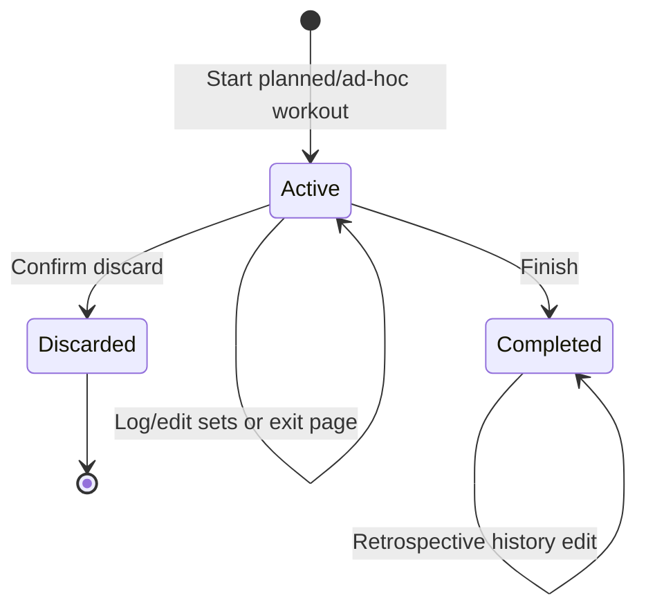

# Personal Workout Tracking Web App — User Flows

**เอกสารต้นทาง:** [Product Requirements](product-requirements.md)  
**หน้าจออ้างอิง:** [Information Architecture](information-architecture.md)  
**การส่งมอบ:** [Development Roadmap](development-roadmap.md)

## 1. Flow conventions

### Actors และ system boundaries

- **Owner:** ผู้ใช้ที่ผ่าน private login
- **Owner device:** อุปกรณ์ที่สร้าง Active Session
- **Client/PWA:** UI, IndexedDB, timer และ sync coordinator
- **Managed backend:** authentication, application API และ relational database

### State transitions

กฎร่วมทุก flow:

- UI mutation ของ Active Session สำเร็จหลังเขียน IndexedDB แล้ว ไม่ต้องรอ network
- Template ถูก snapshot ตอนสร้าง Session
- Server mutations ใช้ stable operation IDs และ version checks
- Planned Session เลื่อน Routine เมื่อ completed เท่านั้น
- Ad-hoc, active และ discarded Sessions ไม่เลื่อน Routine

## 2. UF-01 — Owner login และ initial setup

**Requirements:** FR-AU-01–03, FR-TD-03  
**Pages:** P-01 Login, P-02 Today, P-05 Plans & Routines

**Entry point:** ผู้ใช้เปิดแอปโดยไม่มี authenticated session  
**Preconditions:** owner account ถูก provision แล้ว; public registration ปิด

### Happy path

1. ระบบแสดงหน้า Login โดยไม่มี Sign up CTA
2. ผู้ใช้กรอก credential และ submit
3. Managed auth ตรวจสอบข้อมูลและสร้าง authenticated session
4. ระบบโหลด UserPreference, Active Routine และ Active Session
5. ถ้ายังไม่มี Active Routine หน้า Today แสดง setup guidance และ CTA ไป Plans

### Validation

- Credential ต้องไม่ว่าง
- ทุก protected request ต้องตรวจ owner identity ฝั่ง server

### Alternate/error paths

- Credential ผิด: แสดงข้อความทั่วไปโดยไม่เปิดเผยว่า account มีอยู่หรือไม่
- Network error: คงค่า input และให้ retry; ห้ามเข้า protected data ด้วย unauthenticated state
- Auth session หมดอายุขณะมี unsynced Active Session: เก็บ local data ไว้และขอ login ใหม่ก่อน sync

**State change:** unauthenticated → authenticated  
**Outcome:** เข้าสู่ Today หรือ setup guidance โดยข้อมูล local ที่ยังไม่ sync ไม่ถูกลบ

## 3. UF-02 — ค้นหา สร้าง และ archive Exercise

**Requirements:** FR-EX-01–04  
**Pages:** P-03 Exercise Library, P-04 Exercise Detail / Editor

**Entry point:** Owner เปิด Exercise Library  
**Preconditions:** authenticated และ online สำหรับ mutation

### Happy path — ค้นหา/กรอง

1. ระบบโหลด active starter/custom Exercises
2. ผู้ใช้ค้นหาชื่อหรือเลือก muscle/equipment filter
3. ระบบแสดงผลพร้อมระบุ source และ metadata สำคัญ
4. ผู้ใช้เปิด Exercise Detail เพื่อดูหรือแก้ custom Exercise

### Happy path — สร้าง custom Exercise

1. ผู้ใช้กด Create Exercise
2. กรอกชื่อ, muscles, equipment และ optional description
3. ระบบ normalize ชื่อและตรวจ case-insensitive duplicate
4. บันทึก Exercise และกลับไปยังรายการพร้อม success state

### Archive flow

1. ผู้ใช้เลือก Archive
2. ถ้า Exercise ถูกใช้อยู่ ระบบอธิบายว่าจะซ่อนจากตัวเลือกใหม่แต่ไม่กระทบ History
3. ผู้ใช้ยืนยันและระบบตั้ง `archived = true`

### Alternate/error paths

- ชื่อว่างหรือซ้ำ: แสดง inline validation และไม่ submit
- Offline: อนุญาตดู cached data ถ้ามี แต่ปิด create/edit/archive พร้อมคำอธิบาย
- Archived Exercise ที่อยู่ใน Template: แสดง warning ใน Template Editor จนกว่าจะเปลี่ยนท่า

**State change:** Exercise created/updated/archived  
**Outcome:** Library เปลี่ยนโดย Session/History เดิมยังอ้างอิงข้อมูลได้

## 4. UF-03 — สร้าง Workout Template และ activate Routine

**Requirements:** FR-PL-01–05  
**Pages:** P-05 Plans & Routines, P-06 Workout Template Editor, P-03 Exercise Library

**Entry point:** Owner เปิด Plans & Routines  
**Preconditions:** authenticated, online และมี Exercise อย่างน้อยหนึ่งรายการ

### Happy path — Template

1. ผู้ใช้สร้าง Template และกำหนดชื่อ
2. เพิ่ม Exercises จาก Library
3. กำหนด target set count, rep range, target RIR, rest duration และ note
4. เรียง Exercises แล้ว Save
5. ระบบ validate และบันทึก Template

### Happy path — Routine

1. ผู้ใช้สร้าง Routine และกำหนด weekly frequency target
2. เพิ่ม Templates เป็น ordered sequence เช่น A → B → C
3. กด Activate
4. ระบบ deactivate Routine เดิม ตั้งรายการใหม่เป็น Active Routine และตั้ง `next-workout index = 0`
5. Today พร้อม resolve Template แรก

### Validation

- Template/Routine name ต้องไม่ว่าง
- Template ต้องมี Exercise อย่างน้อยหนึ่งรายการก่อนใช้ใน Active Routine
- Routine ต้องมี Template อย่างน้อยหนึ่งรายการ
- Weekly frequency target ต้องเป็นจำนวนเต็ม 1–7

### Alternate/error paths

- Archive Template ที่อยู่ใน Active Routine: ระบบบล็อกและให้ถอดออกหรือเปลี่ยน Routine ก่อน
- แก้ Template หลังมี History: Save ได้ แต่ไม่แก้ Session snapshots
- เปลี่ยน Active Routine ขณะมี Active Session: ระบบบล็อกจนกว่า Session จะ completed/discarded

**State change:** Templates/Routine created; zero or one Active Routine  
**Outcome:** Today สามารถ resolve next workout ได้

## 5. UF-04 — Resolve Today’s Workout

**Requirements:** FR-TD-01–04, FR-AW-02  
**Pages:** P-02 Today

**Entry point:** Owner เปิด Today  
**Preconditions:** authenticated

### Resolution order

1. ตรวจ Active Session ก่อน
2. ถ้ามี ให้แสดง Resume เป็น primary action พร้อม sync/owner-device state
3. ถ้าไม่มี ให้ตรวจ Active Routine
4. ถ้ามี ให้เลือก Template ที่ `next-workout index`
5. ถ้า index ถึงท้าย sequence ให้วนกลับรายการแรก
6. แสดง preview, previous completion และ Start CTA
7. ถ้าไม่มี Active Routine ให้แสดง setup guidance

### Alternate paths

- Active Session เป็นของอุปกรณ์อื่น: แสดง read-only status และวิธีกลับไป owner device
- Offline และมี cached Active Session: เปิด Resume ได้
- Offline แต่ไม่มี cached plan: ไม่อนุญาตสร้าง planned Session จากข้อมูลที่ไม่พร้อม
- ผู้ใช้เลือก Template อื่นหรือ blank session: สร้างเป็น ad-hoc และไม่เปลี่ยน Routine

**State change:** ไม่มีจนกด Start  
**Outcome:** ผู้ใช้เห็น next action เดียวที่สอดคล้องกับ state ปัจจุบัน

## 6. UF-05 — Start หรือ resume Workout

**Requirements:** FR-AW-01–03, FR-AW-08, FR-TD-02  
**Pages:** P-02 Today, P-07 Active Workout

### Start planned/ad-hoc

1. ผู้ใช้กด Start
2. ระบบตรวจว่าไม่มี Active Session ซ้ำ
3. Planned: snapshot Template/targets; ad-hoc: สร้าง session เปล่าและติด label
4. สร้าง Session ID และ owner-device ID
5. เขียน Active Session ลง IndexedDB
6. ถ้า online ให้สร้าง/claim Session บน server; ถ้า offline ให้ queue operation
7. เปิด Active Workout

### Resume

1. ผู้ใช้กด Resume
2. Client โหลด local session ก่อน
3. ถ้า online เปรียบเทียบ server version โดยไม่ทับ pending local operations
4. เปิด exercise ล่าสุดที่ยังไม่ complete

### Validation และ conflicts

- ถ้ามี Active Session อื่น ให้บล็อก Start และเสนอ Resume/Discard
- ถ้า server ระบุ owner device อื่น ให้เปลี่ยนเป็น read-only และไม่ส่ง mutations
- ถ้า local state เสียหาย ให้เก็บ diagnostic metadata, ไม่ลบอัตโนมัติ และเสนอ retry/recovery

**State change:** not-created → active  
**Outcome:** มี Active Session หนึ่งรายการพร้อม local durability

## 7. UF-06 — Log sets และใช้ rest timer

**Requirements:** FR-AW-04–09, FR-ST-03  
**Pages:** P-07 Active Workout

**Entry point:** Owner device เปิด Active Workout  
**Preconditions:** Session status เป็น active

### Happy path

1. ระบบแสดง Exercise ปัจจุบัน, targets และ previous working-set values
2. ผู้ใช้เลือก warm-up/working และกรอก weight, reps, RIR
3. ผู้ใช้กด Complete Set
4. Client validate ค่า สร้าง stable SetLog/operation IDs และเขียน IndexedDB
5. UI แสดง completed state ทันที
6. Rest timer เริ่มจาก target; ผู้ใช้ pause/reset/skip ได้
7. Sync coordinator ส่ง pending operation เมื่อ online
8. ผู้ใช้ทำซ้ำหรือไป Exercise ถัดไป

### Validation

- Weight ต้องเป็นตัวเลขตั้งแต่ 0 ขึ้นไป, reps ของ completed set ต้องเป็นจำนวนเต็มบวก และ RIR ต้องเป็นจำนวนเต็ม 0–10
- Incomplete set ไม่ใช้คำนวณ Progress
- Timer เป็น UI aid; timer failure ห้ามบล็อกการบันทึกเซ็ต

### Alternate/error paths

- Offline: แสดง Pending/Offline แต่ logging ทำต่อได้
- Server timeout: operation คงอยู่ใน queue และ retry ด้วย ID เดิม
- ผู้ใช้แก้ SetLog ที่ pending: update operation ต้องอ้าง stable SetLog เดิม
- เพิ่ม/ลบ/เรียง Exercise: เปลี่ยนเฉพาะ Session snapshot
- Notification permission ถูกปฏิเสธ: ใช้ in-app timer โดยไม่รบกวน flow

**State change:** Active Session revision เพิ่ม; pending queue เปลี่ยน  
**Outcome:** เซ็ตถูกบันทึกใน local source โดยไม่ต้องรอ network

## 8. UF-07 — Exit, finish หรือ discard Workout

**Requirements:** FR-AW-10–11, FR-HI-01, FR-PR-01–04  
**Pages:** P-07 Active Workout, P-08 Completion Summary, P-09 History

### Exit without finishing

1. ผู้ใช้ออกจากหน้า Active Workout
2. ระบบคง Session เป็น active และไม่เลื่อน Routine
3. Today เปลี่ยน primary action เป็น Resume

### Finish

1. ผู้ใช้กด Finish
2. ระบบสรุป completed/incomplete sets และขอ confirmation หากไม่มี working set
3. Client queue finish operation และเปลี่ยน local state เป็น completed
4. Planned Session เลื่อน `next-workout index`; ad-hoc ไม่เลื่อน
5. ระบบเปิด Completion Summary และคำนวณ PR/metrics ใหม่
6. เมื่อ online server commit Session และ Routine advancement แบบ atomic operation

### Discard

1. ผู้ใช้กด Discard และเห็นผลกระทบ
2. ผู้ใช้ยืนยัน
3. Session เปลี่ยนเป็น discarded, pending mutations ถูกปิดด้วย discard operation
4. Session ไม่เข้า History/Progress และ Routine ไม่เลื่อน

### Error paths

- Finish sync ล้มเหลว: แสดง completed-pending-sync ใน client และ retry โดยไม่เลื่อน Routine ซ้ำ
- อุปกรณ์อื่นพยายาม Finish/Discard: บล็อก ยกเว้น explicit remote-abandon action ที่ไม่ merge ข้อมูล

**State change:** active → completed หรือ discarded  
**Outcome:** Session lifecycle ปิดอย่างชัดเจนและ Progress ใช้เฉพาะ completed data

## 9. UF-08 — Offline persistence, reconnect และ retry

**Requirements:** FR-AW-08–09, FR-ST-02, NFR-03–04  
**Pages:** P-07 Active Workout, P-13 Settings & Sync Status

**Entry point:** network หายระหว่าง Active Session หรือ Session เริ่มขณะ offline  
**Preconditions:** app shell และข้อมูล Session ที่ต้องใช้มีใน local store

### Flow

1. Network status เปลี่ยนเป็น offline; UI แสดง indicator โดยไม่บล็อก logging
2. ทุก mutation เขียน local entity และ append SyncOperation ใน transaction เดียวกัน
3. Reload/browser restart โหลด Active Session และ pending queue จาก IndexedDB
4. เมื่อ reconnect coordinator เรียง operations ตาม session/revision
5. ส่ง operation พร้อม operation ID, device ID และ expected server version
6. Server ตอบ acknowledge, retryable error หรือ conflict
7. Acknowledge: ลบ operation จาก queue และอัปเดต last synced time
8. Retryable: ใช้ backoff และไม่เปลี่ยน operation ID
9. Conflict: หยุด queue ของ Session นั้นและเข้าสู่ UF-09

### Failure safeguards

- ห้าม clear IndexedDB เมื่อ logout โดยอัตโนมัติถ้ามี pending operations
- ห้ามใช้ network response เก่าทับ local revision ใหม่กว่า
- Queue corruption ต้องแสดง recovery state และเก็บข้อมูลต้นฉบับให้ export/debug ได้ใน development builds

**State change:** synced ↔ pending/offline/conflict  
**Outcome:** data sync อย่างน้อยหนึ่งครั้งใน transport แต่เกิดผลเพียงครั้งเดียวบน server

## 10. UF-09 — Active Session ownership conflict

**Requirements:** FR-AW-02–03, FR-AW-09, BR-09  
**Pages:** P-02 Today, P-07 Active Workout, P-13 Settings & Sync Status

**Entry point:** server ปฏิเสธ mutation เพราะ device/version ownership ไม่ตรง  
**Preconditions:** มี local state หรือ pending operations ที่ต้องรักษา

### Flow

1. Client หยุดส่ง operations ของ Session ที่ conflict
2. UI แสดง local version, server-synced summary และ owner-device information
3. ไม่มี automatic last-write-wins หรือ field-level merge
4. Primary action ให้กลับไป owner device
5. Secondary administrative action อนุญาต abandon server session หลังคำเตือน หากผู้ใช้ยืนยันว่าไม่ต้องการข้อมูล unsynced จาก owner device
6. Local conflicting copy ต้องไม่ถูกลบทันทีและต้องไม่ overwrite session ใหม่

**State change:** pending → conflict; server session อาจ active → discarded จาก explicit abandon  
**Outcome:** ไม่มี silent data loss และผู้ใช้ทราบว่าต้องเลือกข้อมูลชุดใด

## 11. UF-10 — Review, edit และ delete History

**Requirements:** FR-HI-01–05  
**Pages:** P-09 Workout History, P-10 History Detail / Edit

**Entry point:** Owner เปิด History  
**Preconditions:** authenticated และ online สำหรับ mutation

### Happy path

1. ระบบแสดง Completed Sessions ใหม่ไปเก่า
2. ผู้ใช้เปิด Session Detail และดู Exercises, sets, notes และ PR
3. ผู้ใช้เข้า Edit, ปรับข้อมูล และ Save
4. Server update Session, บันทึก retrospective-edit marker และ invalidate Progress
5. UI refresh summary และ metrics ที่เกี่ยวข้อง

### Delete

1. Delete ต้องแสดงผลกระทบต่อ Progress และขอ confirmation
2. Server soft-delete Session และ invalidate metrics

### Validation/error paths

- ใช้ validation เดียวกับ Active Workout สำหรับ SetLog
- Archived Exercise ยังแสดงจาก snapshot และเลือกแทนได้เมื่อแก้
- Offline: ดู cached detail ได้ถ้ามี แต่ edit/delete ต้องรอ online

**State change:** completed → edited/soft-deleted  
**Outcome:** History และ Progress สอดคล้องกันหลัง mutation

## 12. UF-11 — Review Exercise Progress

**Requirements:** FR-PR-01–05  
**Pages:** P-11 Progress Overview, P-12 Exercise Progress Detail

**Entry point:** Owner เปิด Progress  
**Preconditions:** authenticated และ online

### Happy path

1. ระบบแสดง Exercises ที่มี completed working sets และ recent PRs
2. ผู้ใช้ค้นหาหรือเลือก Exercise
3. ระบบ aggregate เฉพาะ working sets จาก non-deleted Completed Sessions
4. แสดง best weight, best reps at weight, volume, estimated 1RM และ trend
5. ผู้ใช้เลือก data point หรือ PR เพื่อเปิด Session ต้นทาง

### Alternate/error paths

- ไม่มีข้อมูล: แสดง CTA ไป Today/Plans แทนกราฟว่าง
- Session เพิ่งแก้และ cache กำลัง refresh: แสดง stale indicator จนคำนวณเสร็จ
- Calculation error: ไม่แสดงค่าเก่าราวกับเป็นค่าปัจจุบัน; แสดง retry state และ log error

**State change:** ไม่มี source mutation  
**Outcome:** ผู้ใช้ตรวจ progressive overload และ trace ทุกค่าไปยัง History ได้
